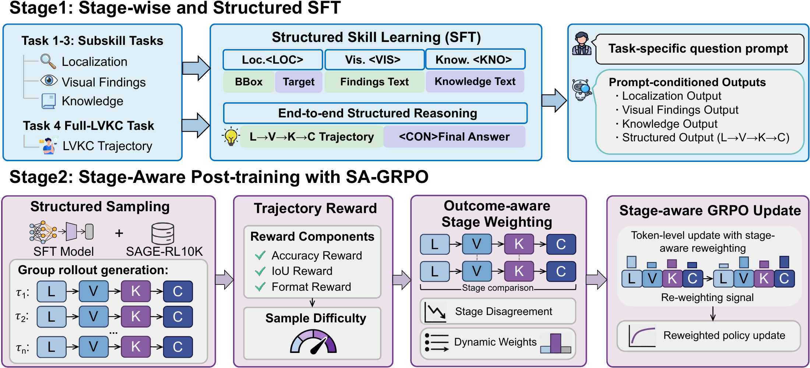
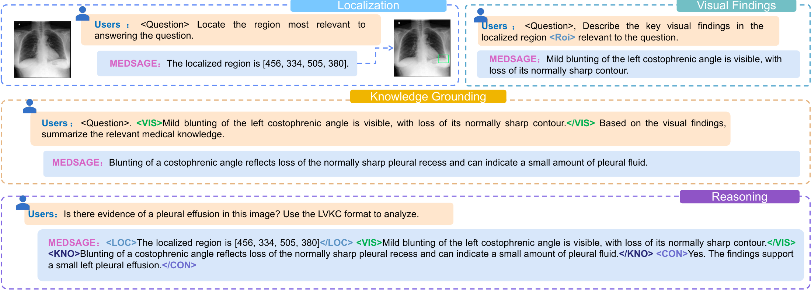
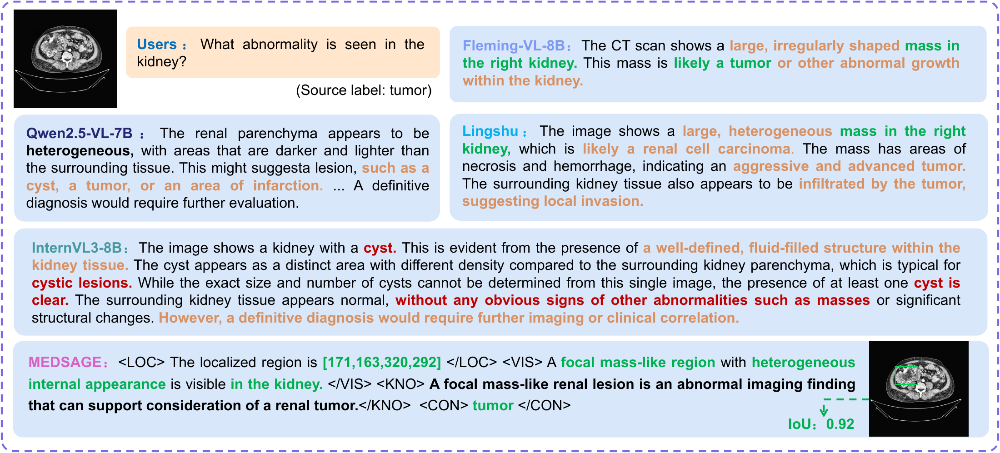
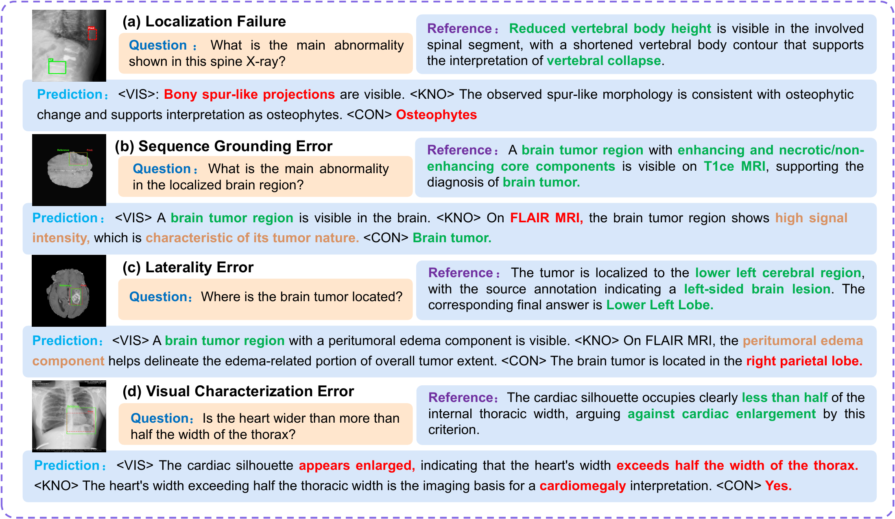

# MEDSAGE

Structured medical visual reasoning with Localization, Visual Findings,
Knowledge Grounding and Conclusion (LVKC).






## Setup

Use Linux, Python 3.10+ and four CUDA GPUs. Install LLaMA-Factory for SFT/DPO
and a compatible EasyR1 environment for RL. Keep the environments separate.

```bash
python scripts/prepare_easyr1.py --source /path/to/EasyR1 --destination /path/to/EasyR1-MEDSAGE
export EASYR1_ROOT=/path/to/EasyR1-MEDSAGE
```

## Data

Use standard LLaMA-Factory ShareGPT JSON arrays. Place `sft_train.json`,
`preferences.json`, `images/` and [dataset_info.json](examples/dataset_info.json)
under `DATA_ROOT`.

SFT records contain only `conversations` and `images`:

```json
{
  "conversations": [
    {"from": "human", "value": "<image>Question and task instruction."},
    {"from": "gpt", "value": "Supervised response."}
  ],
  "images": ["images/example.png"]
}
```

DPO records contain `conversations`, `images`, `chosen` and `rejected`:

```json
{
  "conversations": [{"from": "human", "value": "<image>Question."}],
  "images": ["images/example.png"],
  "chosen": {"from": "gpt", "value": "Preferred response."},
  "rejected": {"from": "gpt", "value": "Less preferred response."}
}
```

Stage tags are text inside the assistant response, not extra data fields:
`<LOC>...</LOC><VIS>...</VIS><KNO>...</KNO><CON>...</CON>`.
Localization uses `{"bbox_xyxy_pixel": [[x1,y1,x2,y2]]}` in image pixels.
Single-stage targets contain their stage tag; AnswerQA uses an untagged answer.

## Training

| Setting | SFT | GRPO / SA-GRPO | DPO |
| --- | --- | --- | --- |
| Epochs | 3 | 2 | 2 |
| Learning rate | 1e-5 | 1e-5 | 1e-5 |
| Token limit | 4096 total | 2048 prompt + 1024 response | 3072 total |
| Precision | bf16 | bf16 | bf16 |
| Backend | DeepSpeed | EasyR1/FSDP | DeepSpeed |

Configurations are in `configs/`. SFT/DPO seeds and RL data/rollout seeds
default to 42. GRPO and SA-GRPO share six rollouts, rewards and symmetric
clipping (`epsilon=0.2`).

```bash
export MODEL_PATH=/path/to/Qwen2.5-VL-7B-Instruct
export DATA_ROOT=/path/to/data
bash scripts/train_sft.sh
```

Use one shared LVKC-SFT checkpoint and RL partition for both RL methods:

```bash
export SFT_MODEL_PATH=/path/to/lvkc-sft
python scripts/prepare_rl_data.py --input /path/to/rl-train.json --image-root "$DATA_ROOT" --output outputs/runtime/train.jsonl
python scripts/prepare_rl_data.py --input /path/to/development.json --image-root "$DATA_ROOT" --output outputs/runtime/val.jsonl
export RL_TRAIN_FILE="$PWD/outputs/runtime/train.jsonl"
export RL_VAL_FILE="$PWD/outputs/runtime/val.jsonl"
bash scripts/train_rl.sh grpo
bash scripts/train_rl.sh sagrpo
```

The RL adapter accepts single-image, single-turn Full-LVKC or final-answer
records. It rejects partial L/V/K supervision without a terminal answer.

```bash
python dpo/scripts/generate_preferences.py \
  --input "$RL_TRAIN_FILE" --output-dir /path/to/preferences \
  --model "$SFT_MODEL_PATH" --processor "$SFT_MODEL_PATH" \
  --reward "$PWD/rewards/combined_reward.py" --seed 42 \
  --group-size 6 --max-response-length 1024 --max-model-len 3072
bash scripts/train_dpo.sh
```

## Tests

```bash
export MEDSAGE_TEST_TOKENIZER="$SFT_MODEL_PATH"
PYTHONPATH="$EASYR1_ROOT:$PWD" python -B -m pytest tests dpo/tests
```

Tokenizer tests require a local checkpoint. CPU tests do not replace GPU validation.

Public benchmark evaluation follows a unified [MedEvalKit](https://github.com/alibaba-damo-academy/MedEvalKit)-based protocol, with reference to the evaluation setup of Lingshu.

## Acknowledgments

Built with [LLaMA-Factory](https://github.com/hiyouga/LLaMA-Factory),
[EasyR1](https://github.com/hiyouga/EasyR1) and [verl](https://github.com/volcengine/verl).
We thank the [Lingshu](https://alibaba-damo-academy.github.io/lingshu/) team for releasing MedEvalKit.
See [third-party notices](THIRD_PARTY_NOTICES.md) and [Apache-2.0 license](LICENSE-EasyR1).
